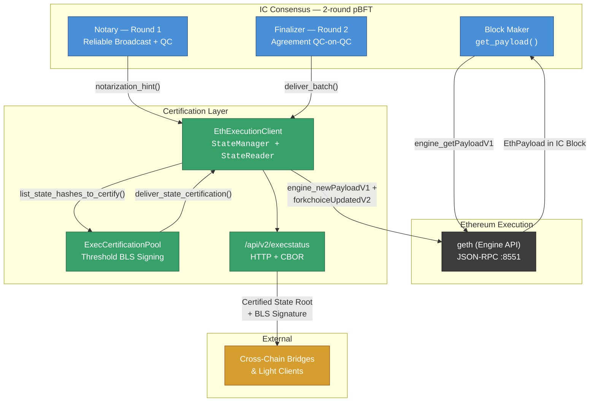
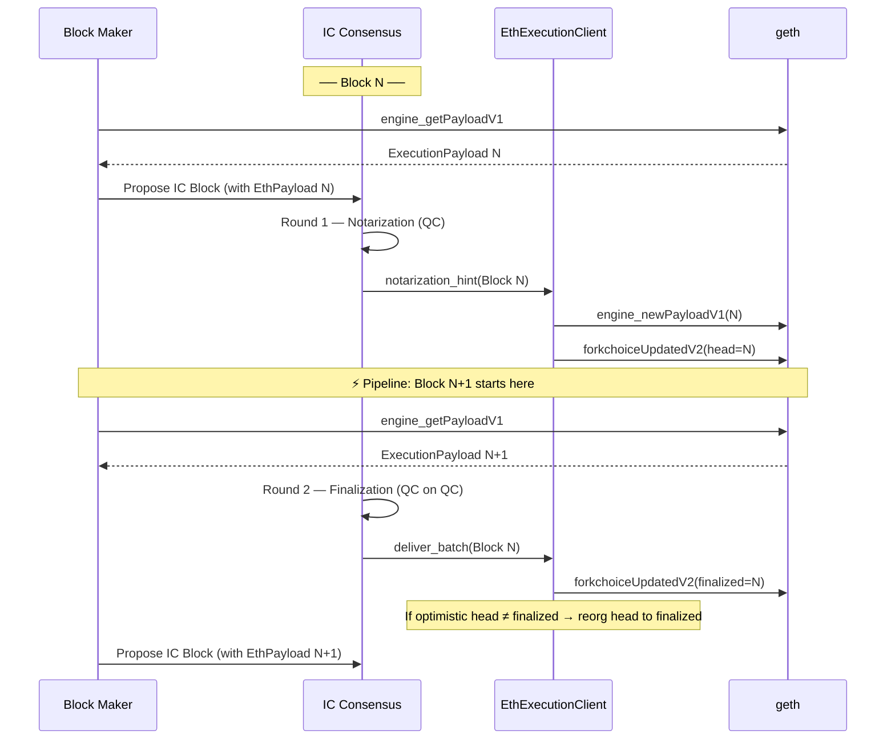
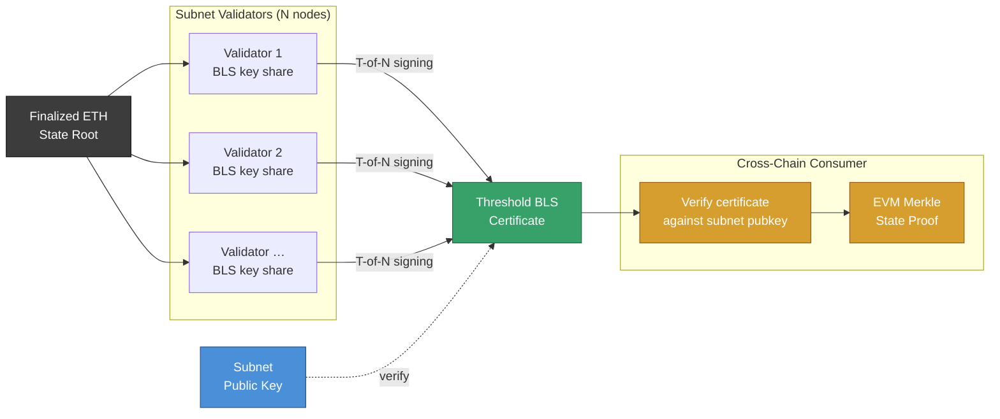
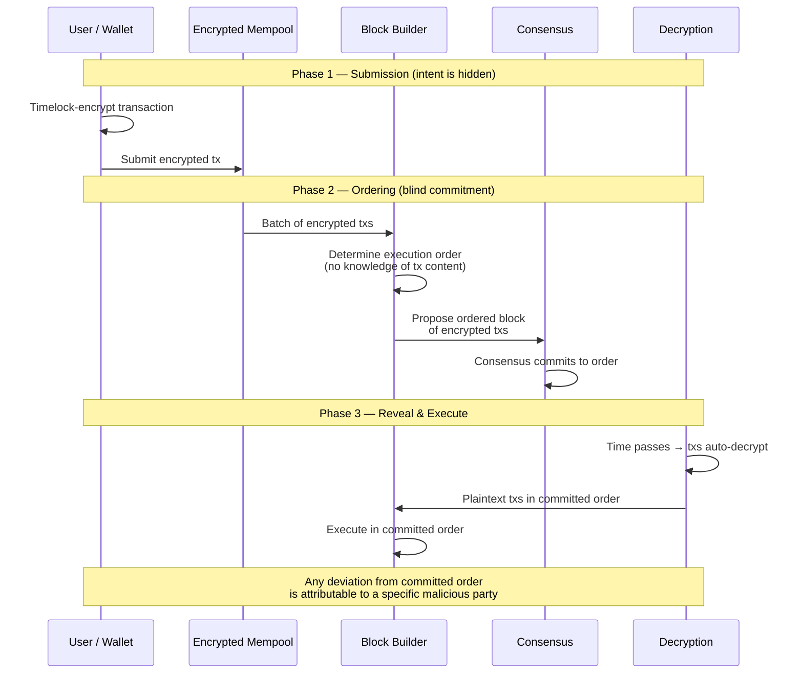
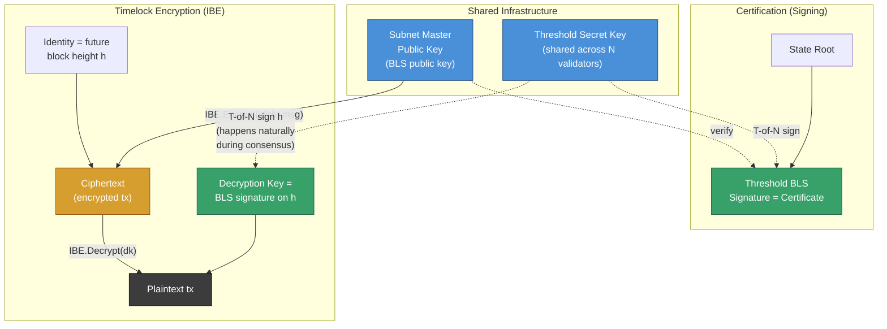

# Ethereum on IC Consensus

<p align="center">
  
</p>

> **Certified BFT consensus driving Ethereum block production with threshold-signed state attestations and optimistic pipelining.**

This fork of the [Internet Computer Protocol](https://internetcomputer.org) replaces the Ethereum Beacon Chain with IC's 2-round pBFT consensus, producing threshold-BLS-certified Ethereum state roots suitable for trustless cross-chain communication.

---

## Architecture



---

## Optimistic Pipelining

> Blog: [Optimistic EVM Execution with Rotating Leader Consensus](https://medium.com/@farazshaikh/consensus-notes-fixed-tradeoff-between-rotating-leader-and-optimistic-execution-for-ethereum-b7d1fb928e62)

The key latency optimization: block N+1 starts building during block N's second consensus round.



Without pipelining, each block waits 2 full consensus rounds. With the notarization hint, validators optimistically assume honest finalization and begin building the next block after round 1 — **cutting effective block time in half**.

Safety: if the optimistic assumption fails, HEAD forks are reverted but FINALIZED state is never compromised. This mirrors Ethereum's own commitment levels (HEAD / SAFE / FINALIZED).

---

## Certified Consensus — Cross-Chain Authentication

> Blog: [Certified Consensus: Cross-Chain Communication in L2/L3 Blockchains](https://medium.com/@farazshaikh/certified-consensus-state-attestation-function-for-cross-chain-communication-68688a08208c)



Two building blocks enable cross-chain communication:

1. **Authentication** — Threshold BLS signatures give the subnet a persistent public key. Any finalized state root signed by T-of-N validators is verifiable by anyone holding the subnet's public key.
2. **Vector Commitment** — The EVM Merkle state tree is the de-facto standard. Once the state root is authenticated, standard Merkle proofs attest to any account balance, storage slot, or contract state.

Together: **Certified State Root + Merkle Proof = Trustless Cross-Chain Read**.

---

## Time-Locked Encryption — MEV Protection

> Blog: [Time Encrypted Mempool](https://medium.com/@farazshaikh/timelock-encrypted-and-encrypted-mempools-962ebd901faa)

MEV (Miner Extractable Value) lets block builders front-run, sandwich, or reorder transactions for profit. The solution is **pre-trade privacy**: encrypt transactions so their intent is hidden until execution order is already committed.



**How it works:**

1. **Encrypt** — Clients timelock-encrypt transactions before submission. The ciphertext is guaranteed to become decryptable after a fixed time window, with no trusted party needed.
2. **Commit** — The block builder orders encrypted transactions and publicly commits to a sequence. Since transaction content is hidden, front-running, sandwich attacks, and other MEV strategies have no information to exploit.
3. **Reveal & Execute** — After the time window, transactions decrypt and execute in the committed order. Any deviation from the published order is cryptographically attributable.

This eliminates the information asymmetry that makes MEV possible. The approach is not crypto-specific — traditional finance suffers the same problem (e.g., Citadel Securities was fined $700K for front-running client orders).

### BLS as Identity-Based Encryption — Dual Use of the Threshold Key

The same threshold BLS key infrastructure used for state root certification doubles as a **timelock encryption** scheme via the [Boneh-Franklin IBE construction](https://crypto.stanford.edu/~dabo/papers/bfibe.pdf).



Under Boneh-Franklin, a BLS key pair is also an IBE key pair:

- **Master public key** = the subnet's BLS public key (already published for certificate verification).
- **Identity** = an arbitrary string — here, a future block height `h`.
- **Encrypt** = anyone can encrypt a transaction to identity `h` using only the master public key. No interaction with validators needed.
- **Decrypt** = the decryption key for identity `h` is the BLS signature on `h`. During normal consensus at height `h`, validators collectively produce exactly this signature as part of block certification. The decryption key materializes as a **byproduct of consensus** — no extra protocol round required.

This means the threshold BLS signing that already certifies state roots *also* provides the timelock decryption keys for the encrypted mempool, giving both features from a single cryptographic setup.

**Status:** Design-level proposal. The consensus and certification layers in this repo provide the substrate on which an encrypted mempool can be built.

---

## Commit History

| # | Commit | Tag | Summary |
|---|--------|-----|---------|
| 1 | `33647a7` | `FEAT-KVM` | Boot IC subnets on local KVM VMs — `icos_deploy_local.sh`, `bobcat`/`frz13` environments |
| 2 | `c4b1d64` | `FIX-DFX-REPL` | Artifact pool fix to hot-swap dfx replica with local Bazel/Cargo build |
| 3 | `2873987` | `FEAT-ETH-PART` | Guest OS partition layout: add encrypted Ethereum data partition for geth |
| 4 | `9215331` | `FEAT-GETH` | Integrate go-ethereum into the OS image — systemd service, genesis bootstrap |
| 5 | `d3a0b63` | `FEAT-EXEC-API` | Add Ethereum Engine API client library as Bazel dependency |
| 6 | `7002486` | `FEAT-ETH-INT` | Core consensus/execution integration — `EthPayloadBuilder`, `EthMessageRouting`, payload embedding |
| 7 | `4842eef` | `FEAT-ETH-CERT` | Threshold BLS certification of Ethereum state roots — `ExecCertificationPool`, `StateManager` impl |
| 8 | `c0a4eb2` | `FEAT-HTTP-CERT` | HTTP endpoint `/api/v2/execstatus` serving certified state roots as CBOR |
| 9 | `1b1cfa8` | `FEAT-OPTIMISTIC` | Optimistic block building via notarization hints — pipeline cuts latency in half |

**83 files changed, +2,634 / -127 lines** from base `a404154` (upstream IC).

---

## Key Components

### `rs/consensus/src/consensus/eth.rs`

The central integration point. `EthExecutionClient` wraps geth's Engine API and implements:

- **`EthPayloadBuilder`** — called by the block maker to fetch an Ethereum execution payload from geth and embed it in IC consensus blocks.
- **`EthMessageRouting`** — called by the finalizer (`deliver_batch`) and notary (`notarization_hint`) to push agreed-upon blocks back to geth.
- **`StateManager`** — queues finalized state roots for threshold BLS certification and delivers completed certificates.
- **`StateReader`** — serves the latest certified state root to the HTTP layer.

### `rs/artifact_pool/src/exec_certification_pool.rs`

A parallel certification pool (`ExecCertificationPoolImpl`) backed by LMDB. Mirrors the existing IC certification pool but tracks Ethereum state root attestations under a separate `ExecCertificationArtifact` kind, keeping P2P message multiplexing clean.

### `rs/http_endpoints/public/src/execstatus.rs`

Tower HTTP service at `/api/v2/execstatus`. Returns CBOR-encoded responses containing the latest certified height, threshold BLS certificate, and replica metadata — the external interface for cross-chain bridges and light clients.

### `rs/types/types/src/eth.rs`

Core data types:
- `EthPayload` — serialized execution payload + timestamp, embedded in IC block proposals.
- `EthExecutionDelivery` — consensus height + payload, passed to geth post-finalization.

---

## Blog Posts

These articles describe the theory behind this implementation:

- [**Certified Consensus: Cross-Chain Communication in L2/L3 Blockchains**](https://medium.com/@farazshaikh/certified-consensus-state-attestation-function-for-cross-chain-communication-68688a08208c) — Authentication via threshold signatures + EVM state trees as vector commitments for trustless cross-chain reads.

- [**Optimistic EVM Execution with Rotating Leader Consensus**](https://medium.com/@farazshaikh/consensus-notes-fixed-tradeoff-between-rotating-leader-and-optimistic-execution-for-ethereum-b7d1fb928e62) — Pipelining block production across consensus rounds using notarization hints, halving effective block time.

- [**Time Encrypted Mempool**](https://medium.com/@farazshaikh/timelock-encrypted-and-encrypted-mempools-962ebd901faa) — Pre-trade privacy via timelock encryption to eliminate MEV — a design-level proposal for future work.

---

## Quick Start

```bash
# Build the replica with Ethereum support
bazel build --compilation_mode=dbg //rs/replica:replica

# Deploy a local 2-subnet topology on KVM
./testnet/tools/icos_deploy_local.sh
```

---

## License

See [LICENSE](LICENSE).
